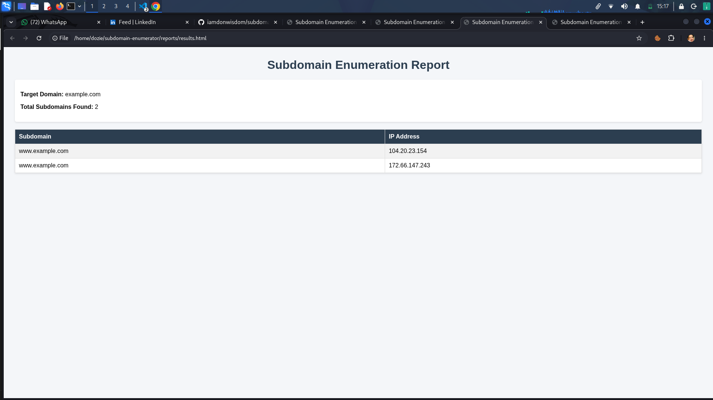
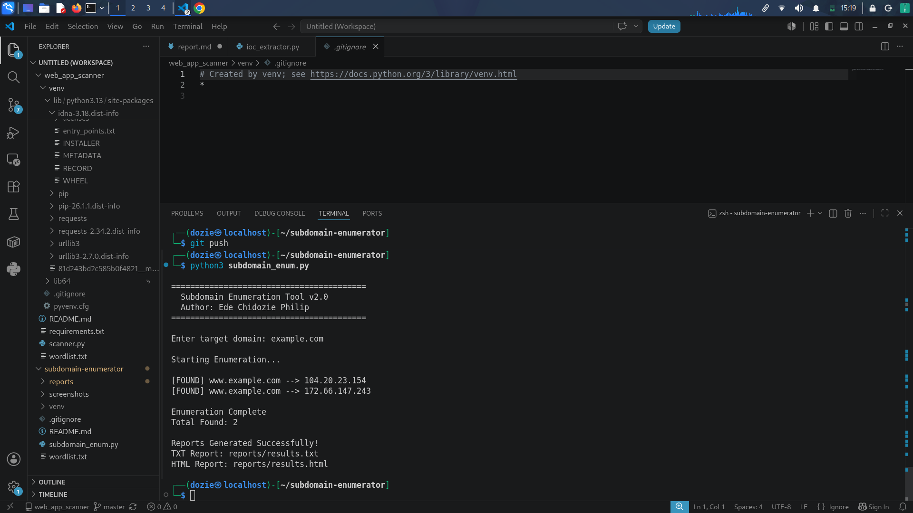

# Subdomain Enumeration Tool

A Python-based reconnaissance tool designed to discover subdomains associated with a target domain. This project demonstrates fundamental penetration testing and bug bounty reconnaissance techniques by automating DNS-based subdomain enumeration and generating professional reports.

---

## Features

- DNS-based subdomain enumeration
- Multi-threaded scanning for faster performance
- Automatic IP address resolution
- TXT report generation
- HTML report generation
- Clean and readable output
- Designed for reconnaissance and asset discovery

---

## Technologies Used

- Python 3
- dnspython
- ThreadPoolExecutor
- Kali Linux
- Git & GitHub

---

## Project Structure

```text
subdomain-enumerator/
│
├── reports/
│   ├── results.txt
│   └── results.html
│
├── subdomain_enum.py
├── subdomain_enum_v1.py
├── wordlist.txt
└── README.md
```

---

## Installation

Clone the repository:

```bash
git clone https://github.com/iamdonwisdom/subdomain-enumerator.git
cd subdomain-enumerator
```

Create a virtual environment:

```bash
python3 -m venv venv
source venv/bin/activate
```

Install dependencies:

```bash
pip install dnspython
```

---

## Usage

Run the tool:

```bash
python3 subdomain_enum.py
```

Enter a target domain when prompted:

```text
Enter target domain: example.com
```

Example output:

```text
=========================================
  Subdomain Enumeration Tool v2.0
  Author: Ede Chidozie Philip
=========================================

Starting Enumeration...

[FOUND] www.example.com --> 93.184.216.34

Enumeration Complete
Total Found: 1
```

---

## Reports

The tool automatically generates:

### TXT Report

```text
reports/results.txt
```

### HTML Report

```text
reports/results.html
```

The HTML report provides a structured view of discovered subdomains and associated IP addresses.

---

## Screenshots

### Terminal Output



### HTML Report



---

## Disclaimer

This tool is intended for educational purposes and authorized security testing only.

Always obtain proper permission before scanning domains or systems you do not own.

---

## Author

**Ede Chidozie Philip**

GitHub: https://github.com/iamdonwisdom

LinkedIn: https://www.linkedin.com/in/ede-chidozie-9728652a9

---

## Future Improvements

- Subdomain brute forcing with larger wordlists
- DNS record enumeration
- ASN lookup integration
- Export to CSV
- Dark-themed dashboard
- Integration with public reconnaissance sources
